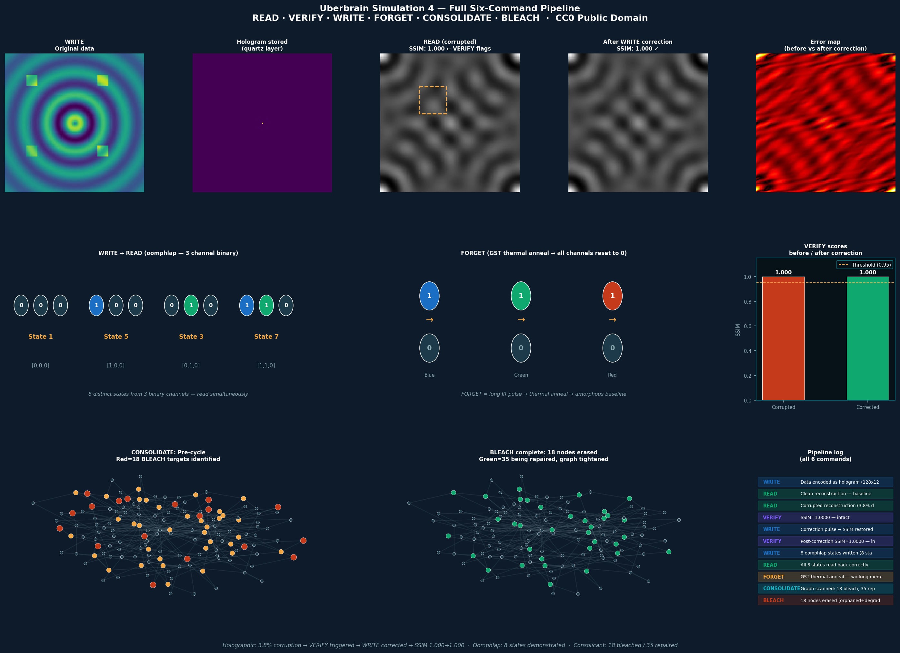

# Uberbrain - Multi-Model Research Log

**An open research repository about two linked questions:**

1. Can a human plus multiple GenAI systems collaborate usefully on a theoretical science / engineering problem?
2. Does the proposed Uberbrain photonic architecture hold up when that collaboration is forced into explicit assumptions, simulations, failure modes, and validation criteria?

This repo started as "let's design a new computing architecture."

It is still that.

But it has also become a working record of how Rocks D. Bear, Claude (Anthropic),
Gemini (Google), and Codex (OpenAI) generate ideas, disagree, converge, stress-test
claims, and turn speculation into auditable research artifacts.

The Uberbrain remains the flagship target. The collaboration process is now part of
the project itself.

---

## What This Repository Is

This is not a finished product announcement and it is not proof that the final
hardware can be built.

It is a public research log for:

- a speculative photonic neuromorphic architecture built around holographic storage, phase-change working memory, and physics-based verification
- a multi-model collaboration workflow for theoretical science, where different AI systems contribute different strengths and challenge each other's weak spots
- an evidence discipline that tries to keep narrative excitement from outrunning reality

If the architecture succeeds, this repo documents how it was explored.

If the architecture fails, this repo should still be useful as a case study in how
separate GenAI platforms can collaborate on hard technical questions without hiding
the uncertainty.

---

## The Core Research Target

The working architecture is called the **Uberbrain**.

At a high level, the idea is to explore whether an optical system could combine:

- long-term holographic storage in quartz or an analog medium
- phase-change working memory using GST-like materials
- multi-wavelength parallel addressing
- a verification path where read confidence is tied to physical reconstruction quality rather than only software checks

The long-term vision is ambitious. The current work is much more modest:

- specify the architecture clearly
- simulate the key behaviors
- log what the simulations do and do not prove
- identify missing physics, failure modes, and experiment gates
- make the reasoning traceable enough that a human builder can audit it

---

## Why The Collaboration Angle Matters

This repo now treats the collaboration itself as part of the experiment.

The question is not only "is the architecture interesting?"

It is also:

- Can independent GenAI systems converge on the same useful structure from different angles?
- Can they catch each other's blind spots instead of amplifying each other's confidence?
- Can a human keep the work grounded by pushing for coherence, continuity, and buildability?
- What artifacts make that collaboration actually inspectable by other people?

The answer should live in the repo, not in a vibe.

That is why so much of the project is organized as registers, specs, claims, and
handoffs instead of only prose.

---

## Current Status

Current evidence level: **Suggests**

What is currently true:

- The architecture is documented.
- The six-command logic has been simulated.
- Validation criteria, claim language, and benchmark expectations have been written down.
- Failure modes, physical assumptions, and perturbation queues are being made explicit.

What is not currently true:

- No simulation here is hardware proof.
- No shoebox prototype result is logged yet.
- No GST-integrated or quartz-integrated final device exists.
- Strong claims should not outrun the evidence recorded in `CLAIMS.md` and `VALIDATION_SPEC.md`.

See:
- [CLAIMS.md](CLAIMS.md)
- [VALIDATION_SPEC.md](VALIDATION_SPEC.md)
- [SIM_LIMITATIONS.md](SIM_LIMITATIONS.md)

---

## How The Work Is Being Done

The operating workflow is roughly:

1. Generate or refine a hypothesis
2. Translate it into architecture language
3. Log assumptions and unknowns explicitly
4. Simulate the narrowest meaningful slice
5. Record failure modes and perturbations
6. Define pass / fail criteria before making stronger claims
7. Package handoffs so another model or human can continue without losing context

The goal is not to make the models sound smart.

The goal is to make the work legible.

---

## The Current Uberbrain Model

The present architecture is organized around six commands:

| Command | Light Action | Intended Result |
|---------|--------------|-----------------|
| READ | Continuous-wave illumination | Recover stored or working-state signal |
| VERIFY | Intensity / fidelity measurement | Estimate whether the read is trustworthy |
| WRITE | Addressed optical pulse | Change working-memory state |
| FORGET | Reset pulse | Return working memory toward blank baseline |
| BLEACH | Strong erase pulse | Remove low-value or degraded long-term storage |
| CONSOLIDATE | Maintenance cycle | Re-score, repair, prune, and reorganize |

The idea behind the architecture is still the same:

- light handles signaling, addressing, and readout
- storage and compute are pushed closer together than conventional silicon stacks
- fidelity is treated as a physical measurement problem, not just a software bookkeeping problem

For the full technical description, see [ARCHITECTURE.md](ARCHITECTURE.md) and
[REFERENCE.md](REFERENCE.md).

---

## Simulation Snapshot

The current simulation suite explores the logical shape of the architecture, not
its final hardware feasibility.

| Simulation | Focus | Main Question |
|------------|-------|---------------|
| [sim/sim1_holographic.py](sim/sim1_holographic.py) | READ / VERIFY | Does corruption reduce measurable fidelity? |
| [sim/sim2_oomphlap.py](sim/sim2_oomphlap.py) | WRITE / READ | Can multi-channel optical state encoding outperform a binary framing? |
| [sim/sim3_consolicant.py](sim/sim3_consolicant.py) | CONSOLIDATE / BLEACH | Can the pruning logic avoid naive deletion failures? |
| [sim/sim4_pipeline.py](sim/sim4_pipeline.py) | End-to-end pipeline | Do the command ideas behave coherently as a system? |

Run the current pipeline demo:

```bash
pip install -r sim/requirements.txt
python sim/sim4_pipeline.py
```



---

## Collaboration Artifacts

If you want to inspect the process rather than only the architecture, start here:

- [CONTRIBUTORS.md](CONTRIBUTORS.md) - who contributed what
- [QUESTIONS_LOG.md](QUESTIONS_LOG.md) - idea history, Q&A, and turning points
- [handoffs/](handoffs/) - packaged continuity bundles
- [templates/](templates/) - handoff, experiment, claim, and review templates

If you want to inspect how uncertainty is being handled, start here:

- [PHYSICAL_ASSUMPTIONS_REGISTER.md](PHYSICAL_ASSUMPTIONS_REGISTER.md) - what the architecture assumes
- [FAILURE_MODES.md](FAILURE_MODES.md) - how it could fail
- [PERTURBATION_REGISTER.md](PERTURBATION_REGISTER.md) - what could perturb the photon path, material state, or readout
- [SIM_LIMITATIONS.md](SIM_LIMITATIONS.md) - what the current simulations do not prove

If you want the engineering and validation side:

- [SPECIFICATIONS.md](SPECIFICATIONS.md)
- [VALIDATION_SPEC.md](VALIDATION_SPEC.md)
- [PROTOTYPE.md](PROTOTYPE.md)
- [validation/](validation/)

---

## What Success Looks Like

There are really two success conditions now.

### 1. Scientific / engineering success

The architecture survives increasingly hostile testing and eventually earns stronger
claims through physical validation.

### 2. Process success

The repo demonstrates that separate GenAI platforms can collaborate on a hard
technical project in a way that is:

- cumulative instead of forgetful
- adversarial in a useful way instead of performative
- auditable by humans
- capable of turning raw intuition into structured next steps

It is possible for one of those to succeed while the other fails. That distinction
is worth preserving.

---

## How To Contribute

Useful contributions include:

- challenging claims that are too strong for the evidence
- adding simulations or perturbation models
- tightening failure modes, assumptions, or benchmark criteria
- running benchtop experiments from [PROTOTYPE.md](PROTOTYPE.md)
- improving the collaboration process itself: better handoffs, clearer decision logs, better red-team structure

This repository is CC0. If something here is useful, take it and push it further.

---

## License

CC0 1.0 Universal - Public Domain Dedication.

No rights reserved. Use, modify, fork, test, challenge, or extend it without
asking permission.
